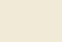

# Проект “TimeLoop”

**created by _Kuba Andrey_ (@sollmater12) and _Drugov Ivan_ (@vanyadr)**

## **TimeLoop** 
    - интересная аркадная игра, которая увлечет не только малышей, но и взрослых людей, желающих с удовольствием скоротать время. 

## Цель игры 
    - преодалеть как можно большее расстояние, забраться на максимальную высоту. 
    Представьте, что вы попали на планету, где гравитация ничтожно мала, а также с помощью специального таймера вы можете останавливать время. Да-да, вы не ослышались - останавливать время! 
    Когда вы нажимаете кнопку на часах, для вас время останавливается, но оно начинает идти для окружающей действительности. Повторное нажатие кардинально меняет ситуацию с точностью наоборот - вы двигаетесь, для вас время идет, а все окружающее замерло. Но вот незадача - вы умеете только прыгать вертикально вверх, движения вбок недоступны. Чем выше вам удастся забраться, тем круче. Удачи!
## Цель проекта 
    - создание многооконного приложения-игры на основе PyGame. Однако, наша команда подошла к вопросу с креативной стороны, мы не стали брать всем уже известные игры, а попытались придумать собственную оригинальную механику.

## Структура игры:
    1. Окно регистрации/входа в аккаунт
    - Возможность регистрации пользователя по имени и заданному паролю
    - Вход в игру по данным пользователя 
    2. Главное стартовое окно игры
        - Возможность начать игру
        - Возможность посмотреть рекорд
        - Управление настройками игры (регулировка звука, сложности)
    3. Окно игры
        - Происходит сам процесс игры
        - Возможность поставить игру на паузу
        - Возможность выйти из игры

## Управление персонажем:
    • Передвижение происходит с помощью стрелок на клавиатуре или клавишами WASD

    • Остановка/возобновление времени происходит на пробел клавиатуры

## Требования к графическому дизайну:
    • В приложение используются светлые тона, всё выполнено в однотонном стиле.
    • Не рекомендуются использовать темные тона, резкие картинки, слишком яркие изображения
    • Предложенные цвета:
  

## Лингвистические требования к игре: 
    Приложение создано для русскоязычных пользователей и не имеет английской версии.
## Идеи модификации проекта:
    • Добавление различных видов плит
    • Добавление других режимов
    • Добавление мобов на карте

